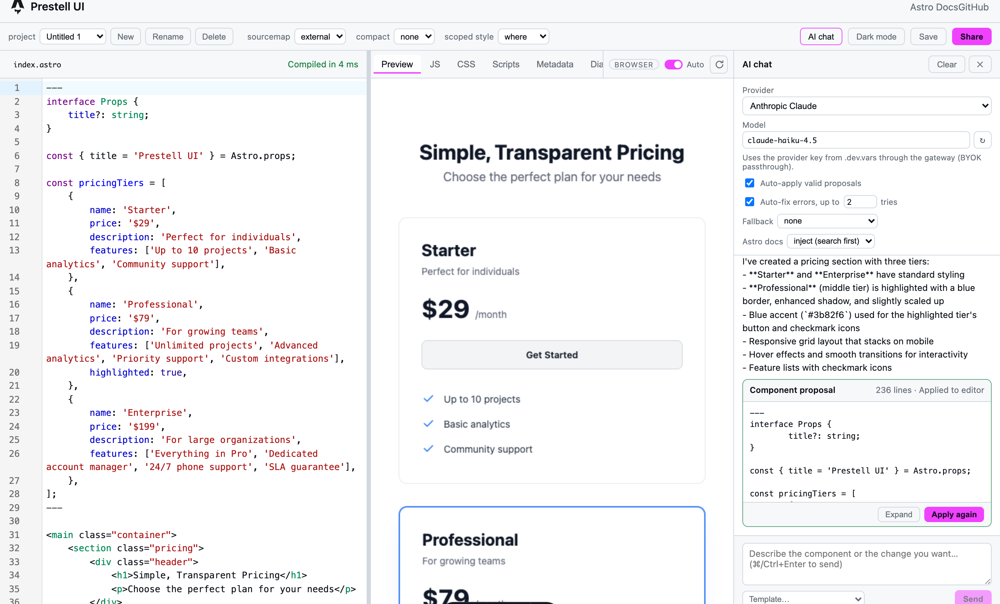

# Prestell UI

[](https://github.com/c-tomioka/prestell-ui/actions/workflows/ci.yml) [](./LICENSE.txt)

> An AI chat builder for [Astro](https://astro.build/): describe a component, get `.astro` code that is validated by the real Astro compiler, and preview it instantly in the browser.

[日本語版 README はこちら](./README.ja.md)

Prestell UI is a "v0 / bolt.new for Astro" built on top of the official [Astro Playground](https://github.com/withastro/astro-playground). It runs on the Cloudflare Workers runtime locally (`astro dev` = workerd), talks to local or cloud LLMs, and uses the [Astro Docs MCP Server](https://docs.astro.build/en/reference/developer-tools/#astro-docs-mcp-server) so generated code follows current Astro APIs.



## Features

- **Chat to code** – generate and edit Astro components. Every proposal is compiled with `@astrojs/compiler` (WASM) and rejected if it cannot render, so broken code never reaches the editor.
- **Live preview in the browser** – rendering runs in a Web Worker with `astro/container`; no server round-trip. Server-side rendering via Cloudflare Worker Loader is available as an option.
- **Components, pages, and sites** – a project is a set of files. Start from a **Component** (one self-contained `.astro` file), a **Page** (index page + layout + global CSS), or a **Site** (pages, layout, shared components); the file tree, editor tabs, and a page switcher in the preview follow relative `import`s of `.astro` and `.css` files.
- **Export as an Astro project** – Page and Site projects download as a ZIP (or write straight into a folder in Chromium browsers) with `package.json`, `astro.config.mjs`, `tsconfig.json`, `src/`, and `public/`, ready for `npm install && npm run dev`.
- **Local or cloud LLMs** – Ollama and LM Studio (no API key), or Anthropic Claude, OpenAI, Google Gemini, and Workers AI through Cloudflare AI Gateway (BYOK).
- **Two connection modes** – **Server** sends requests through this app's `/api/chat` (keys stay in `.dev.vars`); **Direct** lets the browser call Ollama, LM Studio, Anthropic, OpenAI, or Google AI Studio itself with your own key, with no API server involved.
- **Astro knowledge via MCP** – `inject` (default) searches the Astro docs before each request; `tools` lets the model search on its own. In our evaluation `inject` brought hallucinated Astro APIs to zero for every model tested ([docs/EVALUATION.md](./docs/EVALUATION.md)).
- **Auto-fix loop** – compiler errors, with the offending source line, are sent back to the model automatically (up to a configurable number of attempts).
- **English and Japanese UI** – the interface follows your browser language and can be switched from the header; the choice is remembered.
- **Projects and templates** – projects and chat history are stored in IndexedDB, 18 built-in prompt templates, and one-click save to a `.astro` file (File System Access API or download).

## Status

**Public since 2026-09-07 (`v0.1.0`)**; Phase 3 of the [roadmap](./docs/ROADMAP.md) is complete and Phase 4, the static-host (BYOK) version, is in progress: the direct connection mode is done, the Astro docs relay Worker, the sandboxed preview origin, and the static build are next. Phase 5, the multi-file site builder, is in progress: the project model (Component / Page / Site), the file tree, page previews with relative `import`s, and export as an Astro project (ZIP / folder) are done; AI generation across several files and image uploads are next. The preview does not support framework components, `client:*` directives, npm or `astro:*` imports, or external scripts. A hosted SaaS is a later phase; SaaS-only code lives outside this repository ([docs/OSS_SCOPE.md](./docs/OSS_SCOPE.md)).

## Requirements

- Node.js 24 or newer and pnpm 11 (picked automatically through the `packageManager` field)
- Optional: [Ollama](https://ollama.com/) or [LM Studio](https://lmstudio.ai/) for local models
- Optional: a Cloudflare account with [AI Gateway](https://developers.cloudflare.com/ai-gateway/) for cloud models and Workers AI

## Quick start

```bash
git clone https://github.com/c-tomioka/prestell-ui.git
cd prestell-ui
pnpm install
cp apps/playground/.dev.vars.example apps/playground/.dev.vars   # no edits needed for local LLMs
pnpm dev                                                           # http://localhost:4321
```

The dev server runs as a daemon; stop it with `pnpm dev:stop`. `/api/*` runs in the same workerd process, so there is no separate `wrangler dev`.

To try it without any API key:

```bash
ollama pull qwen2.5-coder:7b
ollama serve
```

Then pick **Ollama (local)** in the AI chat panel, choose the model, and send a prompt such as:

```text
Make a pricing section with three tiers and a highlighted middle plan. Use a blue accent.
```

## LLM providers

All configuration lives in `apps/playground/.dev.vars` (git-ignored; template in `.dev.vars.example`).

| Provider | Needs | Environment variables |
|---|---|---|
| Ollama | `ollama serve` on your machine | `OLLAMA_BASE_URL` (default `http://localhost:11434/v1`) |
| LM Studio | the local server started (GUI or `lms server start`) | `LMSTUDIO_BASE_URL` (default `http://localhost:1234/v1`) |
| Workers AI | Cloudflare AI Gateway | `CF_AI_GATEWAY_URL`, `CF_AI_GATEWAY_TOKEN`, `CF_AI_GATEWAY_ID` |
| Anthropic / OpenAI / Google | AI Gateway plus a provider key: either stored in the Gateway (BYOK / Unified Billing) or set locally and passed through | the three above, plus `ANTHROPIC_API_KEY` / `OPENAI_API_KEY` / `GOOGLE_API_KEY` |
| Astro Docs MCP | nothing | `ASTRO_DOCS_MCP_URL` (default `https://mcp.docs.astro.build/mcp`) |

In Server mode local servers are reached from the Workers runtime, not from the browser, so they need no CORS changes (Direct mode does; see below). Never commit `.dev.vars`; see [SECURITY.md](./SECURITY.md).

## Connection modes

The **Connection** setting at the top of the AI chat panel chooses where requests go:

| Mode | Path | Keys | Providers |
|---|---|---|---|
| Server (default) | browser → `/api/chat` (Workers runtime) → provider | `.dev.vars` on the server | all of the above |
| Direct | browser → provider, no API server involved | pasted into the panel; kept in this tab's `sessionStorage`, never in `localStorage` or the URL | Ollama, LM Studio, Anthropic, OpenAI, Google AI Studio |

In Direct mode the panel shows a collapsible "How direct mode works" note with the billing and key-storage rules and a link to each provider's API key page. Direct mode is the basis of the static-host version: usage and rate limits are billed to your own key, and the Astro docs are still fetched through a small relay (`/api/mcp-proxy` today, a stand-alone Worker later) because the MCP server has no CORS headers. Cloudflare AI Gateway and Workers AI cannot be called from a browser (their preflight responses carry no CORS headers, checked 2026-09-07), so Workers AI stays server-only.

To use Direct mode without the dev server (the static-host setup), deploy the docs relay to your own Cloudflare account and point the front end at it:

```bash
pnpm relay:deploy                                                    # Workers Free is enough
PUBLIC_DOCS_PROXY_URL=https://prestell-docs-relay.<you>.workers.dev/search pnpm build
```

The relay (`apps/playground/relay/`) only forwards `search_astro_docs`; it has no secrets, an origin allowlist (`ALLOWED_ORIGINS` in `relay/wrangler.jsonc`), and a per-IP rate limit. `pnpm relay:dev` runs it locally on port 8788. The relay must be reachable anonymously: if your account protects `workers.dev` with Cloudflare Access by default, give this Worker an Access policy of type **Bypass** for Everyone (or turn the protection off for it), otherwise the browser's preflight gets the Access login page instead of CORS headers and the chat falls back to "Astro docs unavailable". Check with `curl -X OPTIONS https://…/search -H "Origin: https://your-front-end" -i`: you should see `Access-Control-Allow-Origin`, not a redirect.

Local servers need to allow the browser's origin in Direct mode: Ollama accepts `localhost` origins by default (set `OLLAMA_ORIGINS=<origin>` for anything else); LM Studio needs `lms server start --cors` or the **Enable CORS** toggle in its Developer tab. Details and the verification log: [docs/LOCAL_LLM.md](./docs/LOCAL_LLM.md).

## Deploy a static (BYOK) build

The static-host version is the front end alone: `dist/client` served as static files, Direct mode only (the Server / Direct switch is hidden and `/api/*` is never called), your own API keys, and two small Cloudflare Workers that need no paid plan. Hosts that cannot set response headers (GitHub Pages, for example) are not suitable: the WASM compiler needs the COOP / COEP headers from `public/_headers`.

1. Deploy the docs relay once (see above) and note its URL.
2. Build with the two origins baked in. The preview sandbox frame must come from a **different** origin than the app, so the same build is deployed twice:

   ```bash
   cd apps/playground
   PUBLIC_DOCS_PROXY_URL=https://prestell-docs-relay.<you>.workers.dev/search \
   PUBLIC_PREVIEW_ORIGIN=https://prestell-ui-preview.<you>.workers.dev \
   pnpm build:static
   pnpm deploy:static            # app:      https://prestell-ui-static.<you>.workers.dev
   pnpm deploy:static:preview    # sandbox:  https://prestell-ui-preview.<you>.workers.dev
   ```

   Both use `wrangler.static.jsonc` (Workers static assets, no Worker code, no secrets). Rename the Workers with `--name` or in the config if you like; the preview origin only has to match `PUBLIC_PREVIEW_ORIGIN`. Cloudflare Pages works the same way with `wrangler pages deploy dist/client`.
3. Lock the relay to your app: set `ALLOWED_ORIGINS` in `relay/wrangler.jsonc` to the app origin and redeploy it.
4. If your account protects `workers.dev` with Cloudflare Access by default, add a **Bypass** policy for Everyone on all three Workers (app, preview, relay); otherwise the sandbox frame and the relay get the Access login page instead of the app's requests.

Check the result: the output badge should read `browser · sandboxed`, the chat panel shows "Direct (browser → provider, BYOK)" instead of a Connection switch, and `curl -I https://…/preview/` returns the CSP and COOP / COEP / CORP headers. To try it locally, `pnpm preview:static` serves `dist/client` on http://localhost:8790 with the same headers (use `PUBLIC_DOCS_PROXY_URL=http://localhost:8788/search` and `pnpm relay:dev` for docs).

## Preview rendering

The default renders in a browser Web Worker. To use the server-side renderer (Worker Loader, same as the upstream playground):

```bash
pnpm dev:server
```

The current mode is shown as a badge in the output pane. In browser mode the render Worker runs inside a hidden iframe on a **separate origin** with a strict CSP, so generated code cannot reach the network or this app's storage (badge: `browser · sandboxed`). The dev server provides that origin automatically (`localhost` ↔ `127.0.0.1` / `[::1]`); for a deployed build set `PUBLIC_PREVIEW_ORIGIN` to a second origin that serves the same build (for example a `preview.` subdomain or a second Pages project). Without it the preview still works but runs in the app's own origin and the badge says `browser · not isolated`. Design notes: [docs/PREVIEW_RENDERING.md](./docs/PREVIEW_RENDERING.md).

## Usage

1. Open http://localhost:4321. The editor is on the left, the preview in the middle, the AI chat on the right (toggle with **AI chat** in the toolbar).
2. **New project** (＋) asks for a mode: **Component** (one file, as before), **Page**, or **Site**. Page and Site projects show a file tree on the far left (add, rename or move, delete), tabs above the editor, and a **Page** select in the preview to switch the rendered page. A Component project can be converted to a Page project from the toolbar.
3. Choose a **Connection** (Server or Direct), a provider, and a model. **Astro docs** controls the MCP mode (`inject` by default).
4. Describe the component, or pick a prompt template with **Template…**. `⌘/Ctrl+Enter` sends. The chat edits the file that is open in the editor.
5. Valid proposals are applied to the editor automatically and the preview updates. Invalid ones trigger the auto-fix loop; you can also **Apply anyway**.
6. Refine with follow-up prompts, then **Save** the active `.astro` file, or use **Export** (Page / Site) to download the whole project as a ZIP or write it into a folder. Share links are available for Component projects.

## Documentation

The design documents under `docs/` are written in Japanese.

- [OVERVIEW.md](./docs/OVERVIEW.md) – product goals and requirements
- [ARCHITECTURE.md](./docs/ARCHITECTURE.md) – system design and technology choices
- [ROADMAP.md](./docs/ROADMAP.md) – phases and task lists
- [DEVELOPMENT.md](./docs/DEVELOPMENT.md) – setup details, tuning constants, manual test checklist
- [LOCAL_LLM.md](./docs/LOCAL_LLM.md) – Ollama / LM Studio integration and a step-by-step walkthrough
- [PREVIEW_RENDERING.md](./docs/PREVIEW_RENDERING.md) – browser vs. server preview renderers
- [EVALUATION.md](./docs/EVALUATION.md) – LLM quality / hallucination harness (`pnpm eval`) and findings
- [OSS_SCOPE.md](./docs/OSS_SCOPE.md) – what is open source, the SaaS boundary, and the secrets audit

## Contributing

Issues and pull requests are welcome in English or Japanese. Please read [CONTRIBUTING.md](./CONTRIBUTING.md) first. This project follows the [Contributor Covenant](./CODE_OF_CONDUCT.md); report vulnerabilities privately as described in [SECURITY.md](./SECURITY.md).

## License

[Apache License 2.0](./LICENSE.txt). Portions are derived from the [Astro Playground](https://github.com/withastro/astro-playground) (MIT License, Copyright (c) 2022 Astro); those files carry a header comment and the full MIT text is in [THIRD_PARTY_NOTICES.md](./THIRD_PARTY_NOTICES.md).

## Acknowledgements

- [Astro](https://astro.build/) and the [Astro Playground](https://play.astro.build/)
- [Cloudflare AI Gateway](https://developers.cloudflare.com/ai-gateway/) and Workers
- [Vercel AI SDK](https://ai-sdk.dev/)
- [Ollama](https://ollama.com/) and [LM Studio](https://lmstudio.ai/)
